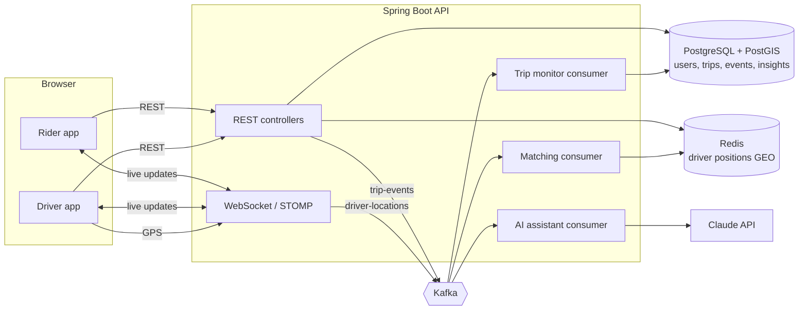

# RideAI

A real-time ride-hailing platform (rider + driver apps) with an **AI Trip Assistant** that analyzes every completed trip and tells the rider what happened and how the next one could go better.

**Stack:** Next.js 16 · Spring Boot 3.5 (Java 21) · PostgreSQL + PostGIS · Redis (GEO) · Kafka · WebSocket (STOMP) · Claude API · Docker · GitHub Actions · Sentry · k6

## What it does

- **Book on a map.** Riders pick pickup and drop-off; the price comes from real road routes (OSRM) and a configurable fare formula.
- **Nearest-driver matching.** Live driver positions live in Redis; `GEOSEARCH` finds free drivers within 5 km, and the ride is offered to one driver at a time for 15 s.
- **Live tracking.** Trip status and the driver's position are pushed to the rider over WebSocket; ride offers are pushed to drivers.
- **Event-driven backend.** Every trip change is a Kafka event. Matching, the AI assistant and trip monitoring are separate consumers.
- **Trip monitoring.** GPS points on Kafka record the route actually driven (stored as a PostGIS line) and raise `DELAY_DETECTED` when a driver falls well behind the estimate.
- **AI Trip Assistant.** After each trip, Java computes the facts (wait times, delays, detour, fare) and Claude explains them with up to 3 suggestions. Riders can ask follow-up questions.
- **Driver simulator.** 15 fake drivers roam Tempe, AZ, accept rides and complete them, so the demo is alive.

## Architecture



How a ride flows:

1. The rider requests a ride. The API saves it as `REQUESTED` and returns immediately; `RIDE_REQUESTED` goes to Kafka after the transaction commits.
2. The **matching consumer** runs `GEOSEARCH` on Redis and offers the ride to the nearest free driver, pushed over WebSocket. Declines and expired offers move to the next driver; a scheduler is the safety net.
3. The driver accepts with a single conditional `UPDATE … WHERE status = 'REQUESTED' AND offered_driver_id = ?`, so two accepts can never both win.
4. While driving, GPS updates go to the rider over WebSocket and to Kafka, where the **trip monitor** records the route and watches for delays.
5. On `TRIP_COMPLETED`, the **AI consumer** computes the metrics, asks Claude for a summary, stores it, and pushes "summary ready" to the rider.

Trips follow a state machine (`TripStatus.java`): `REQUESTED → ACCEPTED → ARRIVED → IN_PROGRESS → COMPLETED`, with `CANCELLED` allowed before the ride starts.

## Run it locally

Prerequisites: Java 21 + Maven, Node.js 22, Docker Desktop.

```bash
cp .env.example .env            # optional: add ANTHROPIC_API_KEY / SENTRY_DSN

docker compose up -d            # Postgres, Redis, Kafka, Kafka UI

cd backend && mvn spring-boot:run          # terminal 2 → http://localhost:8080
cd frontend && npm install && npm run dev  # terminal 3 → http://localhost:3000
node simulator/simulate.mjs                # terminal 4 → 15 drivers online
```

Then open http://localhost:3000 → **Ride with RideAI**, create an account, click the map twice, **See price → Request ride**. Watch a driver accept and drive to you; after drop-off the trip assistant writes its summary.

To be the driver yourself, open a private window, create a driver account, click the map to place your car and **Go online**.

**Everything in Docker** (including the simulator):

```bash
docker compose -f docker-compose.yml -f docker-compose.full.yml up --build
```

Useful UIs: Kafka UI http://localhost:8081 · health http://localhost:8080/actuator/health · system status http://localhost:3000/status

### Configuration

| Variable | Default | What it does |
| --- | --- | --- |
| `ANTHROPIC_API_KEY` | empty | Enables Claude for trip summaries and chat. Empty = rule-based summaries. |
| `ANTHROPIC_MODEL` | `claude-haiku-4-5-20251001` | Model used by the assistant |
| `SENTRY_DSN` / `NEXT_PUBLIC_SENTRY_DSN` | empty | Error monitoring for backend / browser. Empty = off. |
| `JWT_SECRET` | dev value | Must be set (base64, 32+ bytes) anywhere public |
| `ROUTING_ENABLED` | `true` | `false` = straight-line estimates, no internet needed |

Secrets go in `.env` at the repo root (git-ignored). The backend and docker compose both read it; for `npm run dev`, put `NEXT_PUBLIC_SENTRY_DSN` in `frontend/.env.local`.

## AI Trip Assistant

The LLM never does arithmetic or sees personal data. The pipeline:

1. `TripMetricsCalculator` turns the trip and its event timeline into numbers: time to find a driver, declined offers, pickup wait vs ETA, ride time vs estimate, detour %, fare per km, delay alerts, and the rider's history.
2. Deterministic rules set **flags**: `SLOW_MATCH`, `LATE_PICKUP`, `LONG_WAIT`, `SLOW_RIDE`, `ROUTE_DEVIATION`, `DELAY_ALERT`, `SMOOTH_TRIP`.
3. `ClaudeClient` sends the metrics with a **forced tool call** whose JSON schema is `{summary, suggestions[≤3]{title, detail}}`, so the reply is always structured.
4. The reply is validated; on failure it retries once, then falls back to `TemplateInsightWriter`. Token usage is logged per call.
5. Follow-up chat (`POST /api/trips/{id}/assistant`) answers from the same facts, limited to 10 questions per trip.

"Golden trip" tests (`TripAssistantTest`) pin the metrics, flags and fallback behavior.

## API

All endpoints except register/login need `Authorization: Bearer <token>`. Errors look like `{"status": 409, "code": "INVALID_TRANSITION", "detail": "..."}`.

| Method | Path | Who | What |
| --- | --- | --- | --- |
| POST | `/api/auth/register`, `/api/auth/login` | anyone | Returns a JWT |
| POST | `/api/trips/estimate` | rider | Price, distance, time and route line |
| POST | `/api/trips` | rider | Request a ride (matching runs async) |
| GET | `/api/trips/current`, `/api/trips/me` | any | Active trip (204 if none), history |
| GET | `/api/trips/{id}`, `/timeline` | rider, driver | Trip details, event timeline |
| GET | `/api/trips/{id}/insight` | rider, driver | AI summary (404 `INSIGHT_PENDING` until ready) |
| POST | `/api/trips/{id}/assistant` | rider | Ask a question about the trip |
| POST | `/api/trips/{id}/accept`, `/decline` | driver | Respond to an offer |
| POST | `/api/trips/{id}/arrive`, `/start`, `/complete` | driver | Move the trip forward |
| POST | `/api/trips/{id}/cancel` | rider, driver | Cancel before the ride starts |
| PUT | `/api/drivers/me/status`, `/api/drivers/me/location` | driver | Go online/offline, send position |
| GET | `/api/drivers/me`, `/api/drivers/me/offer` | driver | Profile, open offer |
| GET | `/api/drivers/nearby?lat=&lng=` | any | Anonymous positions of free cars |

**WebSocket** (`ws://localhost:8080/ws`, STOMP, header `Authorization: Bearer <token>`):

| Destination | Direction | Payload |
| --- | --- | --- |
| `/topic/trips/{id}` | server → rider, driver | `{type:"trip"}`, `{type:"location", lat, lng}`, `{type:"insight"}` |
| `/user/queue/offers` | server → driver | the offered trip |
| `/app/driver/location` | driver → server | `{lat, lng}` |

**Kafka topics:** `trip-events` (key: trip id) and `driver-locations` (key: driver id), each with a `.DLT` dead-letter topic. Consumer groups: `rideai-matching`, `rideai-ai`, `rideai-trip-monitor`.

## Tests and CI

```bash
cd backend && mvn verify     # unit + integration tests against real Postgres/Redis/Kafka (Testcontainers)
cd frontend && npm test      # Vitest
```

Integration tests cover auth, the full trip lifecycle including async matching and the AI summary, declines, access rules and WebSocket pushes. GitHub Actions runs everything on every pull request and publishes Docker images to GitHub Container Registry on `main`.

## Load test

```bash
brew install k6
k6 run loadtest/driver-locations.js                       # 50 drivers sending GPS every second + 20 nearby searches/s
DRIVERS=200 DURATION=2m k6 run loadtest/driver-locations.js
```

The summary reports requests per second and p95 latency for location updates and nearby searches. It fails if p95 > 200 ms or errors > 1%.

## Project layout

```
backend/src/main/java/com/rideai/
  auth/        register, login, JWT
  rides/       trips, state machine, routing, fares, trip events
  drivers/     driver status and Redis GEO positions
  matching/    nearest-driver offers (Kafka consumer + scheduler)
  realtime/    WebSocket config, STOMP auth, pushes
  monitoring/  route recording and delay detection (Kafka consumer)
  ai/          metrics, Claude client, insights, chat
  events/      Kafka topics, publisher, dedup
frontend/      Next.js: /login, /rider, /driver, /trips/[id], /status
simulator/     fake drivers (Node, no dependencies)
loadtest/      k6 script
```

## Troubleshooting

- **Port in use (5433, 6379, 9092, 8080, 3000):** stop the other process (`docker ps`, `lsof -i :8080`) or change the left port in `docker-compose.yml`.
- **"Reconnecting" badge never turns green:** the browser can't reach `ws://localhost:8080/ws`. Is the backend running? Open the app on `localhost`, not your network IP (or add the origin to `WS_ALLOWED_ORIGINS`).
- **Summary says "Rule-based":** no `ANTHROPIC_API_KEY` in `.env` (restart the backend after adding it).
- **Prices say "straight-line estimate":** the free OSRM server was unreachable.
- **Signed in but everything says 401:** the backend restarted with a different `JWT_SECRET`; sign out and in.
- **Testcontainers says "client version 1.32 is too old":** update Docker Desktop (`backend/src/test/resources/docker-java.properties` pins API 1.44).
- **Clean database:** `docker compose down -v`.

## Resume bullets

> **RideAI: Real-time ride-hailing platform with AI trip insights** · Next.js, Spring Boot, PostgreSQL/PostGIS, Redis, Kafka, WebSocket, Claude API, Docker, GitHub Actions
> - Built an event-driven ride-hailing backend in Spring Boot where trip events flow through Kafka to independent matching, trip-monitoring and AI consumers, with idempotent processing and dead-letter topics.
> - Implemented nearest-driver matching with Redis GEO search, race-free acceptance via conditional updates, and live tracking over WebSocket (STOMP), sustaining **[N] location updates/s at p95 [X] ms** in k6 load tests.
> - Designed an AI Trip Assistant that computes trip metrics in Java and uses the Claude API with schema-enforced tool output, retries and a rule-based fallback to generate per-trip summaries and a follow-up chat.
> - Set up CI with GitHub Actions running unit and Testcontainers integration tests on every PR and publishing Docker images; added Sentry error monitoring across frontend and backend.

Fill in `[N]` and `[X]` from your own k6 run.
